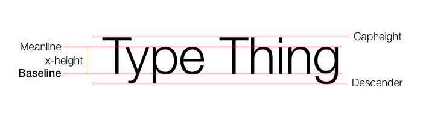
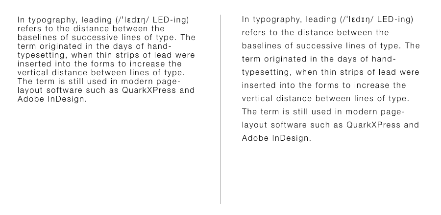
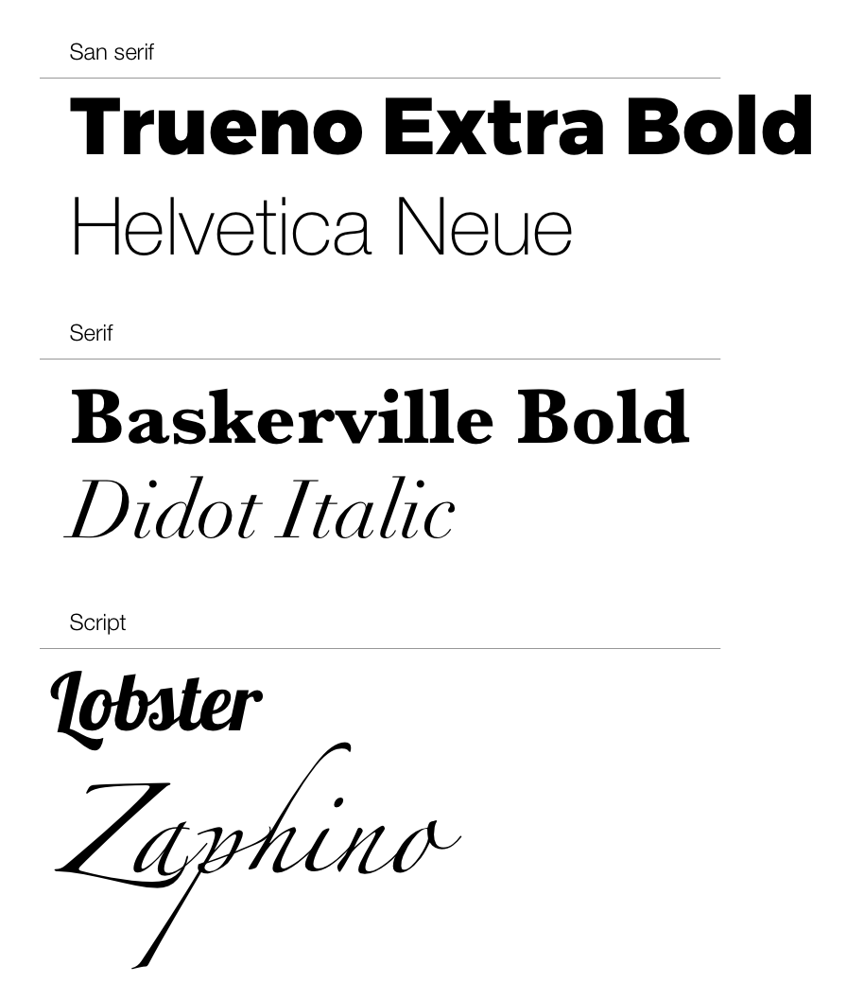
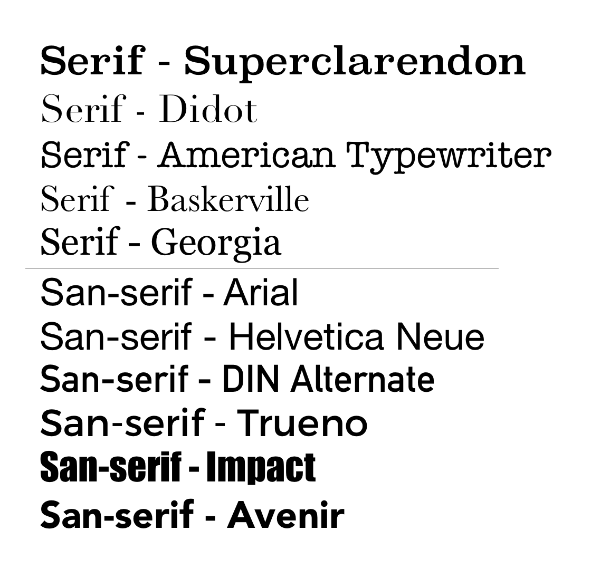
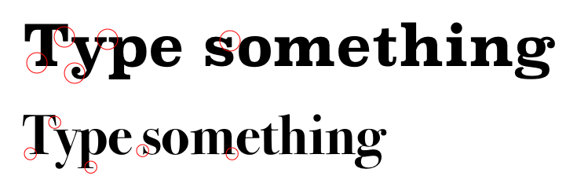

# Design

Design is about communication. As a designer it is your job to 
communicate the values of your product with your audience.

> **Design:** 
> 
> 1) to conceive or execute a plan
> 2) to devise for a specific function or end
> 3) to indicate with a distinctive mark, sign, or name
> 4) to make a drawing, pattern, or sketch of

A product has a purpose, and it's producer values. These should be 
expressed in the design.

> “There are three responses to a piece of design – yes, no, and WOW! 
> Wow is the one to aim for.”
> - **Milton Glaser**

## What are they trying to say?

## Features

Design has these features (in other words you have these features 
to express your message):

- Typography
- Color
- Layout
- Everything else... 

## Typography

> “Typography is the craft of endowing human language with a durable visual form.” 
> ― **Robert Bringhurst**, The Elements of Typographic Style

__Terms__

Actually there are many more [terms](https://i.pinimg.com/originals/58/d8/08/58d8080befdcf6e9f780aa1e1d0cc59e.jpg)

The terms above are most important for layout. Understanding these 
will help explain a lot of the strange behavior you might have 
experienced working with type, and the options present in soft
dealing with type. 

__Kerning__

The space between characters

__Leading__

The space between lines

__Fonts__

__Serif vs San Serif__

__Serif__

Each of these type faces has a different character. Each has 
a different voice. Think of where you may have seen these 
faces before and what the message was.

# Type Hierarchy

__A majority of your content is text.__ Your text needs to look good and read well.
An important part of communication is the order in which you say things.

**Use design to control the order in which your content is read**.

This image explains it all. 

- http://visual.ly/10-building-blocks-visual-hierarchy

You can use these design elements to create hierarchy in your type:

- Color
- Position
- Size
- Style
- Type Contrast
- Weight

### Identify Hierarchy in the wild

Follow one of more of the links below, and look for elements listed above in
the designs. 

Work with a partner. Explore the links below discuss ideas above. Try and find 
an example of each idea (color, position, size, style, Type Contrast, weight). 

1. https://www.behance.net/gallery/38375593/Community-app-for-Factory-campuses
1. http://abduzeedo.com/starbucks-experience-visual-design
1. https://www.behance.net/gallery/57915943/Slade-WebSite-Template-Vol1
1. https://www.behance.net/gallery/56318765/Herschels-Coffee-Co
1. https://www.behance.net/gallery/50422883/Cutme-Mobile-App
1. https://www.behance.net/gallery/50028109/Flight-App-Concept-UI-Kit
1. https://www.behance.net/gallery/53246495/Text-app-design

### Exercise

This is your opportunity to apply some of the ideas yourself. 
Understanding that everyone is working in different areas I 
have supplied three different formats to work in. 

1. Sketch - If you have Sketch and want to work in a purely 
visual design form you can solve the problems in sketch. 
2. HTML/CSS - Use this to solve the problems with CSS. 
3. Xcode - Use storyboard to solve the problems.  

The starter project and files are in the folder below. 

- [Type-Hierarchy-Example](./exercise/)

Use modify the example with the goal of making the type read well. Create
hierarchy between the title, source, heading, and body.

### Resources

- https://webdesign.tutsplus.com/articles/understanding-typographic-hierarchy--webdesign-11636
- http://www.webdesignerdepot.com/2010/01/the-principle-of-proximity-in-web-design/
